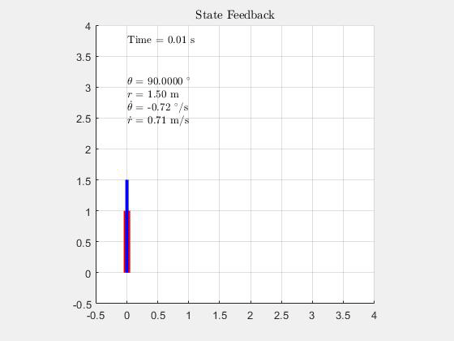
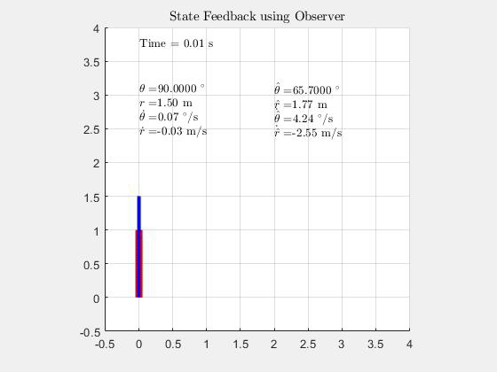
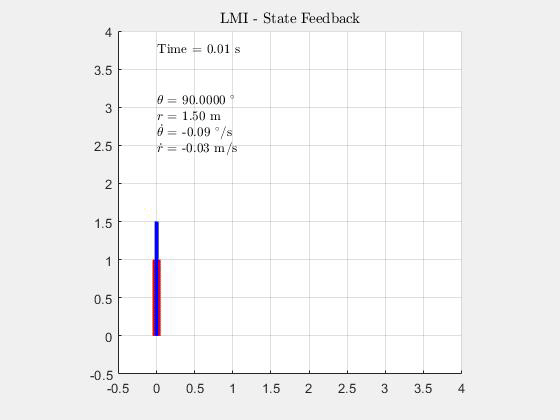
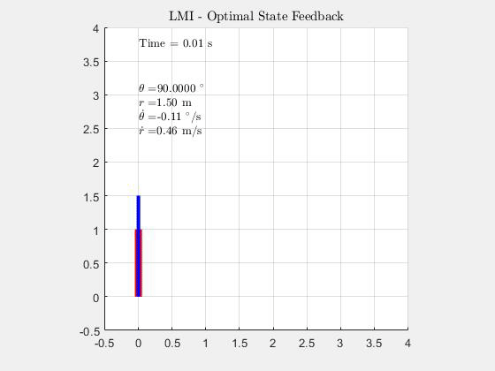
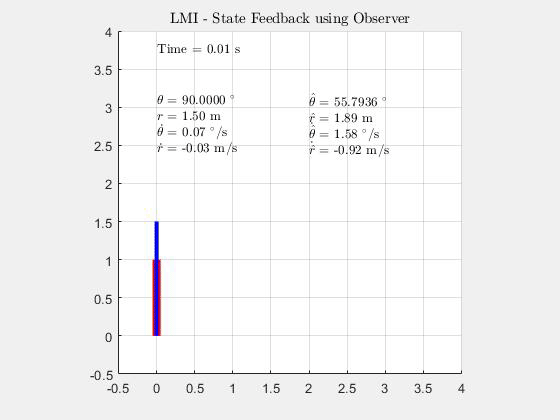

# Control-Systems
## Controlling a R-  Nonlinear Robot Manipulator
### Linearizing the model
The problem statement is to control a Theta-R Robot Manipulator. Since the model is non-linear, to control the robot using linear control methods and techniques we linearize the system about a equillibrium point. The equillibrium point for all the simulation is [pi/4  2  0  0]. 

### Controller Design by Pole Placement
#### [State Feedback](StateFeedback_1.m)
Our goal is to design a linear controller for the nonlinear system. We use the place command in matlab to place poles in the left half plane. The control input is given by U = K X. The controller is then implemented to control the non-linear system and an animation is generated.  

#### [Observer Compensator](ObserverControllerCompensator_1.m)

### Controller Design using Linear Matrix Inequalities(LMIs)
We use the [CVX](http://cvxr.com/cvx/) solver for solving LMIs, one can also use the Robust Control Toolbox from MATLAB.
#### [State Feedback](LMI_StateFeedback_1.m)

#### [Optimal State Feedback](LMI_OptimalStateFeedback_1.m)
We frame the Countinous Algebraic Ricatti Equation as an LMI and solve for feedback gain.  

#### [Observer Compensator](LMI_ObserverControllerCompensator_1.m)

<!---
### Model Predictive Controller
#### State Feedback
#### Observer Compensator
--->

## Ackermann Steering 
#### [Ackermann_Simulator](Ackermann_Simulator.m)
The code simulates a very simplified kinematic model of ackermann steering commonly used in automobiles. 
Ref link: https://www.xarg.org/book/kinematics/ackerman-steering/  
A simple PD controller is used to main a constant lateral distance. For the sake of simplicity we keep the forward velocity constant during the control action. The objective of this code was to biuld an intuition for tuning PD conitrol of an ackermann steered vehicle. 
Controller:  Its worthwhile to mention that steering angle is not the same as car angle. Our control input is the steering angle not car angle, The objective of controller(100Hz) is slow the steering angle enough so that car angle catches up to the steering angle. To achieve this we have the Derevative component of PID. A dead band is also added in the middle, though it is not neccesary. Car dimensions to a 1/10 scale of an actual car.  
Markers:  Box -- Car  Light Green line -- Car Angle (theta)  Blue Line -- Steering Angle (phi) Red Line -- Lateral step or goal  All dimensions are in meters. Car angle and Steering angle plotted at origin.   
Output:  To record a video change "vid_recorder" from 0 to 1. The file name by default is 'ackermann_simulator.avi'.  
Testing:         1) Kp = 1.5, Kd = 25  demos a working control ( but not best)  2) Kp = 1.5, Kd = 30  faster settling time but with steady state error  3) Kp = 1.5, Kd = 5   demos the need of Kd  4) change 'speed' to visualize the affect of car speed on controller  5) change 'goal' to change the goal or lateral step of the car  
Remarks:  The setting point as default is 1.5 m given that car width is  only 0.15m the goal is extermenly large for any controller to reach. A more practical value of 'goal' would be 0.5m.  

##### For latex rendering: https://www.codecogs.com/latex/eqneditor.php

