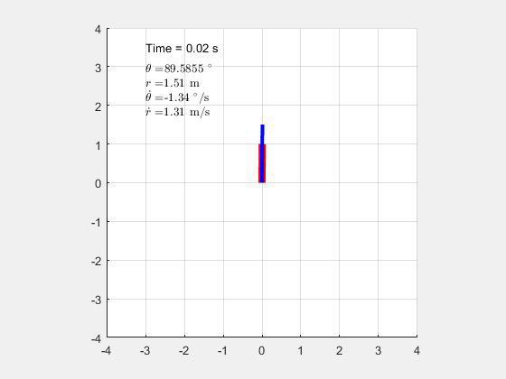

# Control-Systems
## Controlling a R-  Nonlinear Robot Manipulator
### Linearizing the model
The problem statement is to control a Theta-R Robot Manipulator. Since the model is non-linear, to control the robot using linear control methods and techniques we linearize the system about a equillibrium point. The equillibrium point for all the simulation is [pi/4  2  0  0].  
### StateFeedback_1.m
Our goal is to design a linear controller for the nonlinear system. We use the place command in matlab to place poles in the left half plane. The control input is given by U = K X. The controller is then implemented to control the non-linear system and an animation is generated. 

### ObserverControllerCompensator_1.m
This is an explanation. 

##### For latex rendering: https://www.codecogs.com/latex/eqneditor.php

